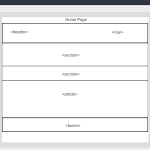
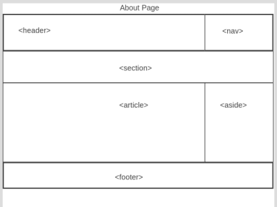
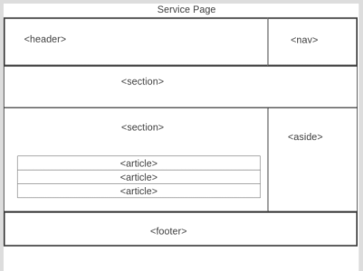

# Development Strategy

> `acme-web-design`

A fictional web site for HYF students to improve their front end skills

## Wireframe

`this web site consist of three web pages`

  

## 0. Set-Up

__Coches can see the initial repository and live demo__

### Repo

1. Created a new repository
2. generated as [this starter template](https://github.com/HackYourFutureBelgium/w3-validation-template).  
3. Give a title to your README  
4. Clone the repository  
5. add meta tags ,css file links and title in the head 
6. add wireframes 
7. Push the changes
8. turn on GitHub Pages

## 1._User Story_: Using header and nav tags

__**As coaches, we want to see header and navbar used in semantic way**__

### Repo

This user story was developed on a branch called `head-nav`

### HTML

- I used `<header> and <nav>` which describe its meaning to both the browser and the developer
- `div` is non-semantic block tag  which will help me with css to manipulating its content
- I gave `id` in div tag which is unique later on I will just change on this part with css or js

- I gave `class` in div tag for css later on which will changes all `class="container" ` align center and gives margin.

- `ul and li` block tags make unorder list  

- `a`inline tag for links the other pages such as `service.html` 

### CSS

After plain HTML, I will change css

## 2. _User Story_: Usig sections element

__**As coaches, we want to see section used in semantic way**__

### Repo

This user story was developed on a branch called `showcase-news`

### HTML

- I used `<section>` which describe its meaning to both the browser and the developer
- `form` block element which user can pass info on it
- `input` inline block element which shows area to user full info 
- `button` inline block element which submit user info to send server

### CSS

After plain HTML, I will change css

## Finishing Touches

- Write final, complete README:
  - [makeareadme.com](https://www.makeareadme.com/)
  - [bulldogjob](https://bulldogjob.com/news/449-how-to-write-a-good-readme-for-your-github-project)
  - [meakaakka](https://medium.com/@meakaakka/a-beginners-guide-to-writing-a-kickass-readme-7ac01da88ab3)
- Validate code to check for any last mistakes
